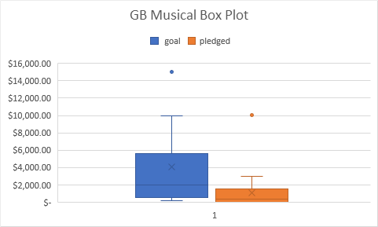
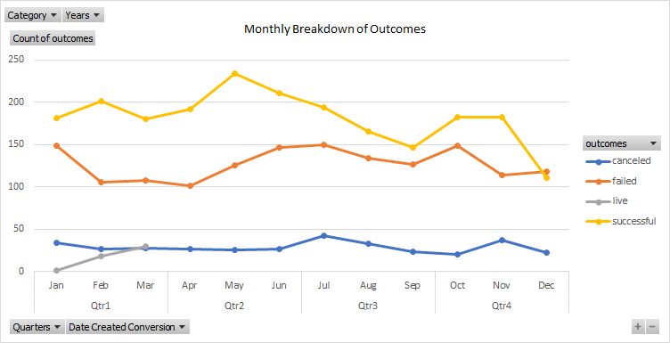
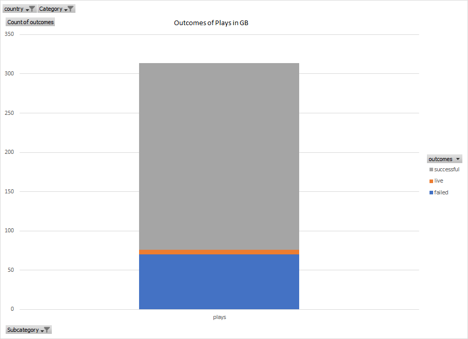

# An Analysis of Kickstarter Campaigns

Louise is looking to start a Kickstarter Campaign for her play Fever in U.S. and is looking for some 
guidance to do so. Louise wants to set her intial goal at the amount of $10,000. She is also curious about 
starting the campaign in Great Britain at an intial goal of £4000. 

After filtering the data in the U.S. through theater and then its sub category plays I have determined that the
average succesful goal of a play campaign is $5049 compared to an unsuccessful play 
campaign at an average of $10,554(Reference Descriptive Statistics worksheet) [Kickstarter_Analysis_Module_1.xlxs](Kickstarter_Analysis_Module_1.zip).

As for Great Britain and starting off with an intial Goal of £4000, it is right around the average, which sits high into the 3rd quartile.
Now the median goal of musical campaigns in Great Britain is at £2000, while the upper end of the pledged
amount sits just below £2000 in the 3rd quartile .

The date to launch the kickstarter is also very important. By breaking down the outcomes based on months, I have 
determined that the second quarter, specifcially may and june, have the highest success rates out of all theater campaigns .

Both the U.S. and Great Britain have alot of succesful theater campaigns, but Great Britain has the higher success rate for plays, which
has 238 succesful while only having 70 failures . 

My recommendation to Lousie is to launch her campaign in Great Britain during the months of May or June and to lower her intial goal
down to £1800 to have the best chance at a succesful campaign.
