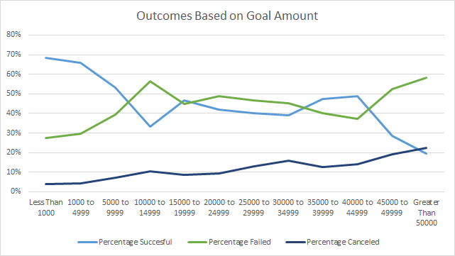

# An Analysis of Kickstarter Campaigns

## Overview

*Louise is looking to start a Kickstarter Campaign for her play Fever in U.S. and is looking for some 
guidance to do so. Louise wants to set her intial goal at the amount of $10,000. She is also curious about 
starting the campaign in Great Britain at an intial goal of £4000.* 

## Findings

After filtering the data in the U.S. through theater and then its sub category plays I have determined that the
average succesful goal of a play campaign is $5049 compared to an unsuccessful play 
campaign at an average of $10,554(Reference Descriptive Statistics worksheet) [Kickstarter_Analysis_Module_1.xlxs](Kickstarter_Analysis_Module_1.zip).

As for Great Britain and starting off with an intial Goal of £4000, it is right around the average, which sits high into the 3rd quartile.
Now the median goal of musical campaigns in Great Britain is at £2000, while the upper end of the pledged amount sits just below £2000 in the 3rd quartile. 

The date to launch the kickstarter is also very important. By breaking down the outcomes based on months, I have 
determined that the second quarter, specifcially may and june, have the highest success rates out of all theater campaigns

Both the U.S. and Great Britain have alot of succesful theater campaigns, but Great Britain has the higher success rate for plays, which
has 238 succesful while only having 70 failures. 

## Recommendation

**My recommendation to Lousie is to launch her campaign in Great Britain during the months of May or June and to lower her intial goal
down to £1800 to have the best chance at a succesful campaign.**

### Challenge

Module 1 Kickstarter Analysis Challenge File [Module_1_Challenge.xlsx](Module_1_Challenge.xlsx)

Kickstarter play campaigns with goals of $5000 or less have the highest chance of success with an average of 67%. Kickstarter play 
campaigns with goals higher than $5,000 had roughly the same success and failure percentages with the outcomes 
favoring failure beyond $45,000. Throughout the intial goal ranges, canceled projects had a direct 
correlation to the increase in goal amounts, with it starting at just 4% for less than $1,000 and ending with 23% 
at $50,000 or more. 

The best time to start a kickstarter play campaign is in the second quarter during the months of May and June. These two 
months have the highest amount of successful outcomes which supports the idea that it does matter when someone launches a campaign.
Now I was curious and the average length of time for a kickstarter campaign turns out to be 31 days, which further 
supports that when someone like Louise launches her campaign again, that late in the second quarter and early in the 
third are the best times to do so. 

All analysis was performed on strictly play campaigns. I could have created additional graphs based on muscials or other 
sub categories within theater to see if maybe play wasn't the best fit for Louise. This was a sample size, plays, and was 
relatively small so I could find another source of kickstarter campaigns, that were based on plays, to help create more 
accurate conclusions. It will still be a sample size of the entire population of all campaigns relevant to plays out 
there but the more I can pool together and normalize the better my predictions will be. 
